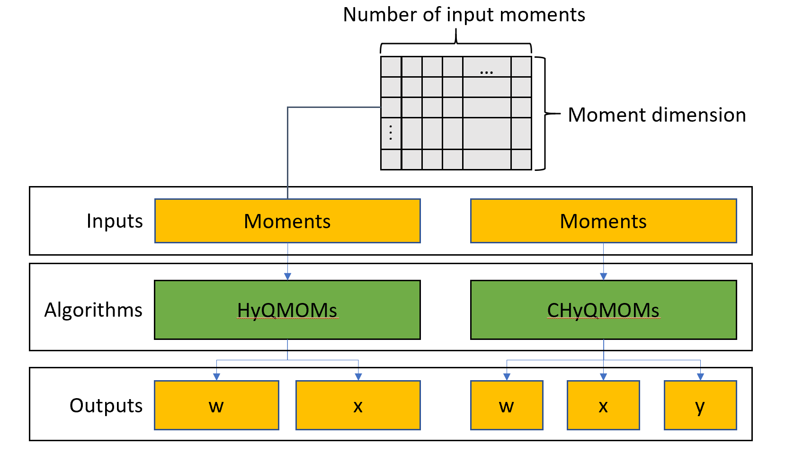

GPU Input and Output
====================

For the C++ (both CPU and GPU) versions of the algorithms, the input moments is initialized as 2D arrays. 
Array size in the x-direction (columns) represent number of inputs. Array size in the y-direction (rows) 
represent moment dimensions, which depends on the algorithm. In CPU code, the input array is flattened in 
column-major format, because the original python code operates on the assumption that moment dimensions is 
represented by rows. In GPU code, the array is flattened in row-major format. HyQMOM algorithms produce two 
outputs: weight :math:`w` and abscissa :math:`x`. CHyQMOMs produce three output arrays: weight :math:`w` and 
abscissas :math:`(x, y)`. 
The output arrays follow the same rules as the input array, with number of columns as number of inputs

